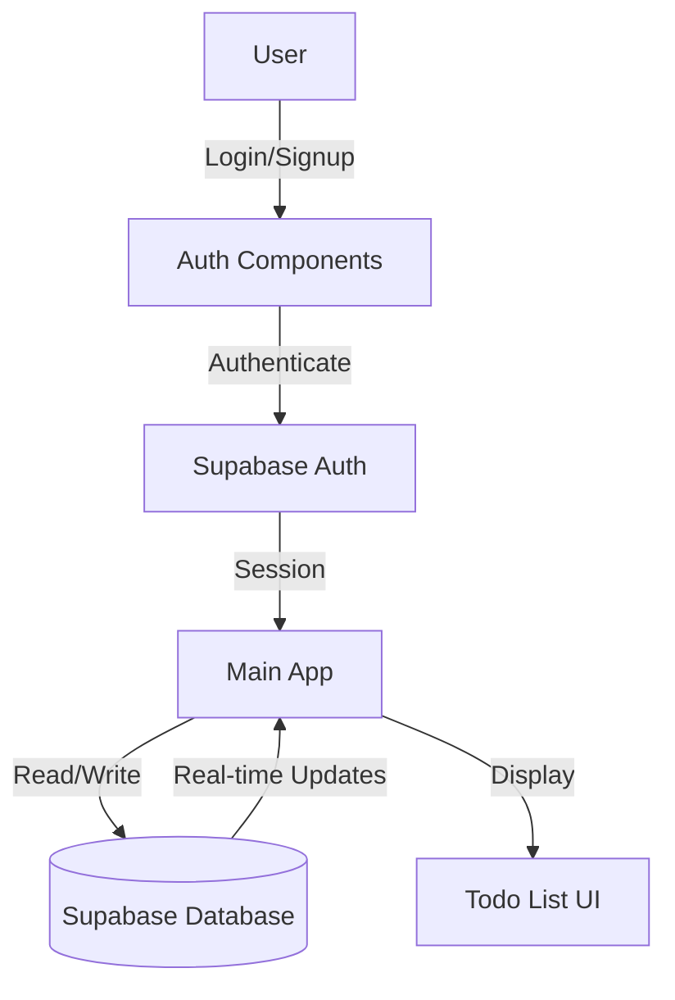

# Supabase Integration for Todo App

## Overview
Integrate Supabase backend for user authentication and persistent todo storage with real-time synchronization across devices.

## Architecture Flow



## Implementation Steps

### 1. Install Dependencies
- Install `@supabase/supabase-js` for Supabase client
- Install `@supabase/auth-ui-react` and `@supabase/auth-ui-shared` for pre-built auth components (optional, or build custom with shadcn)

### 2. Environment Setup
- Create `.env.local` file in `todo-app/` directory
- Add Supabase project URL and anon key as environment variables
- Update `vite.config.ts` to expose environment variables
- Add `.env.local` to `.gitignore` (already exists)

### 3. Database Schema Setup
Create SQL migration in Supabase dashboard:
- **todos table**:
  - `id` (uuid, primary key, default gen_random_uuid())
  - `user_id` (uuid, foreign key to auth.users)
  - `text` (text, not null)
  - `completed` (boolean, default false)
  - `status` (text, check constraint: 'todo' | 'in-progress' | 'done')
  - `created_at` (timestamptz, default now())
  - `updated_at` (timestamptz, default now())

- **Row Level Security (RLS)**:
  - Enable RLS on todos table
  - Policy: Users can only read/write their own todos
  - `SELECT`: `auth.uid() = user_id`
  - `INSERT`: `auth.uid() = user_id`
  - `UPDATE`: `auth.uid() = user_id`
  - `DELETE`: `auth.uid() = user_id`

### 4. Supabase Client Setup
- Create `src/lib/supabase.ts`:
  - Initialize Supabase client with environment variables
  - Export client instance

### 5. Authentication Components
Create auth UI using shadcn components:
- **`src/components/auth/LoginForm.tsx`**: Email/password login form
- **`src/components/auth/SignupForm.tsx`**: Email/password signup form
- **`src/components/auth/AuthModal.tsx`**: Modal wrapper with tabs for login/signup
- Use shadcn `Dialog`, `Tabs`, `Input`, `Button` components
- Handle auth errors and loading states

### 6. Auth Context/Provider
- Create `src/contexts/AuthContext.tsx`:
  - Manage auth state (user, session, loading)
  - Provide auth methods (signIn, signUp, signOut)
  - Listen to auth state changes
  - Export `useAuth` hook

### 7. Update Todo App Logic
Modify `src/App.tsx`:
- Replace `useState` with Supabase queries
- Use `useQuery` pattern or direct Supabase calls
- Implement real-time subscriptions for todo updates
- Add loading and error states
- Update CRUD operations to use Supabase:
  - `addTodo`: Insert into Supabase
  - `toggleTodo`: Update in Supabase
  - `updateTodoStatus`: Update in Supabase
  - `deleteTodo`: Delete from Supabase

### 8. Protected Routes
- Wrap main app with auth check
- Show auth modal if user is not authenticated
- Show todo app if user is authenticated

### 9. Type Definitions
- Update `Todo` interface to match database schema
- Add types for Supabase responses
- Create `src/types/database.ts` for database types

## Files to Create/Modify

**New Files:**
- `todo-app/.env.local` (user will fill in credentials)
- `todo-app/src/lib/supabase.ts`
- `todo-app/src/contexts/AuthContext.tsx`
- `todo-app/src/components/auth/LoginForm.tsx`
- `todo-app/src/components/auth/SignupForm.tsx`
- `todo-app/src/components/auth/AuthModal.tsx`
- `todo-app/src/types/database.ts`

**Modified Files:**
- `todo-app/src/App.tsx` - Replace local state with Supabase
- `todo-app/vite.config.ts` - Add env variable support
- `todo-app/package.json` - Add Supabase dependencies
- `.gitignore` - Ensure .env.local is ignored

## Database Migration SQL

```sql
-- Create todos table
CREATE TABLE todos (
  id UUID PRIMARY KEY DEFAULT gen_random_uuid(),
  user_id UUID NOT NULL REFERENCES auth.users(id) ON DELETE CASCADE,
  text TEXT NOT NULL,
  completed BOOLEAN DEFAULT false,
  status TEXT NOT NULL DEFAULT 'todo' CHECK (status IN ('todo', 'in-progress', 'done')),
  created_at TIMESTAMPTZ DEFAULT now(),
  updated_at TIMESTAMPTZ DEFAULT now()
);

-- Enable RLS
ALTER TABLE todos ENABLE ROW LEVEL SECURITY;

-- RLS Policies
CREATE POLICY "Users can view own todos"
  ON todos FOR SELECT
  USING (auth.uid() = user_id);

CREATE POLICY "Users can insert own todos"
  ON todos FOR INSERT
  WITH CHECK (auth.uid() = user_id);

CREATE POLICY "Users can update own todos"
  ON todos FOR UPDATE
  USING (auth.uid() = user_id);

CREATE POLICY "Users can delete own todos"
  ON todos FOR DELETE
  USING (auth.uid() = user_id);

-- Create index for faster queries
CREATE INDEX idx_todos_user_id ON todos(user_id);
CREATE INDEX idx_todos_created_at ON todos(created_at DESC);
```

## Environment Variables Template

```env
VITE_SUPABASE_URL=your-project-url
VITE_SUPABASE_ANON_KEY=your-anon-key
```

## Testing Checklist
- [ ] User can sign up with email/password
- [ ] User can log in with email/password
- [ ] User can log out
- [ ] Todos persist after page refresh
- [ ] Todos sync across browser tabs/devices
- [ ] Real-time updates work (open in two tabs)
- [ ] RLS policies prevent access to other users' todos
- [ ] Error handling for network failures

## Notes
- Supabase provides real-time subscriptions out of the box
- RLS ensures data security at the database level
- Auth state persists in localStorage automatically
- Consider adding optimistic updates for better UX